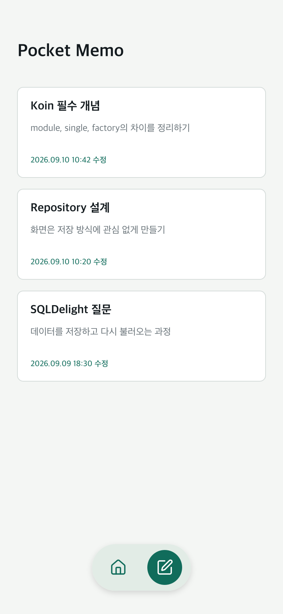

# KMPMemo

Compose Multiplatform으로 Android와 iOS의 UI를 공유하며, Koin과 SQLDelight를 단계적으로 학습하는 메모 앱 프로젝트입니다.

## 기술 스택

| 기술 | 사용 목적 |
| --- | --- |
| Compose Multiplatform (CMP) | Android · iOS 공통 UI |
| Koin | 의존성 주입 학습 및 적용|
| SQLDelight | Koin 학습 후 로컬 데이터 저장 기능 확장 |

## 주요 기능

- 메모 목록: 최근 수정한 순서로 메모 확인
- 메모 조회: 제목, 본문, 수정 시간 확인
- 메모 작성: 제목과 본문을 입력하여 새 메모 저장
- 메모 수정: 기존 메모의 내용을 편집하고 저장
- 메모 삭제: 삭제 확인 후 메모 제거

## 메인 화면

