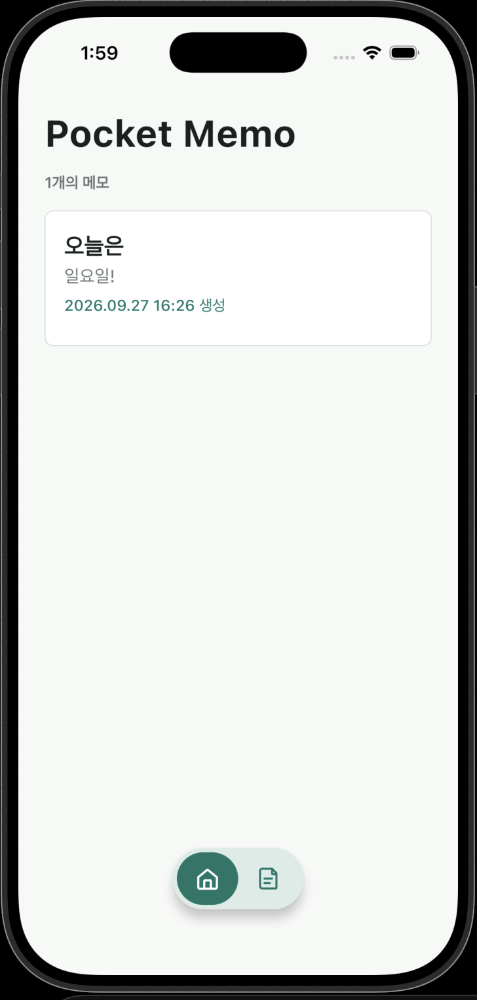
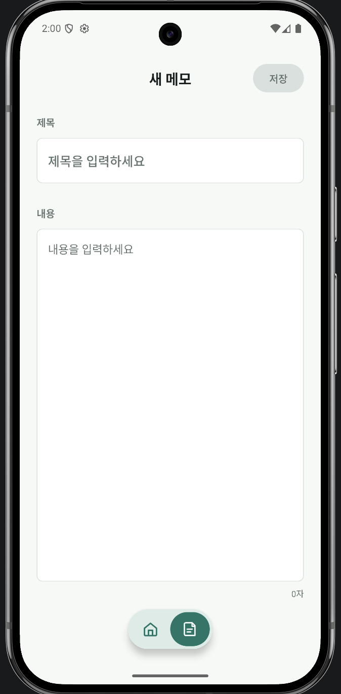

# KMPMemo

Compose Multiplatform으로 Android와 iOS의 UI를 공유하며, Koin과 SQLDelight를 단계적으로 학습하는 메모 앱 프로젝트입니다.

## 기술 스택

| 기술 | 사용 목적 |
| --- | --- |
| Compose Multiplatform (CMP) | Android · iOS 공통 UI |
| Koin | 공통 객체 생성 및 의존성 주입 |
| SQLDelight | Android · iOS 로컬 데이터 저장 및 변경 관찰 |

## 주요 기능

- 메모 목록: 최근 수정한 순서로 메모 확인
- 메모 조회: 제목, 본문, 수정 시간 확인
- 메모 작성: 제목과 본문을 입력하여 새 메모 저장
- 메모 수정: 기존 메모의 내용을 편집하고 저장
- 메모 삭제: 삭제 확인 후 메모 제거

## 프로젝트 구조

```text
shared/src
├── commonMain
│   ├── kotlin/com/example/kmp_memo
│   │   ├── data
│   │   │   ├── database    # 공통 데이터베이스 연결
│   │   │   ├── mapper      # 데이터베이스 모델을 앱 모델로 변환
│   │   │   ├── model       # 앱에서 사용하는 메모 모델
│   │   │   └── repository  # 메모 데이터 접근 인터페이스와 구현체
│   │   ├── di              # Koin 모듈과 초기화
│   │   └── ui              # 메모 목록, 작성·조회 및 공통 UI
│   └── sqldelight
│       └── com/example/kmp_memo/data/database/Memo.sq
├── androidMain/.../data/database  # Android SqlDriver 구현
└── iosMain/.../data/database      # iOS SqlDriver 구현
```

## 데이터 흐름

```text
Screen
  → ViewModel
  → MemoRepository
  → SqlDelightMemoRepository
  → MemoDatabase / MemoQueries
  → SQLite
```

메모 목록은 SQLDelight 쿼리를 `Flow`로 관찰합니다. 메모가 생성, 수정 또트는 삭제되면 쿼리가 다시 실행되고 새로운 목록이 `ViewModel`의 화면 상태로 전달됩니다.

## SQLDelight 적용 내용

- `Memo.sq`에서 메모 테이블과 조회, 생성, 수정, 삭제 쿼리 정의
- Android와 iOS에서 각 플랫폼에 맞는 `SqlDriver` 생성
- SQLDelight 생성 모델을 앱의 `Memo` 모델로 변환
- `Flow`를 사용해 메모 목록 변경을 실시간으로 반영
- Koin으로 데이터베이스, 저장소 및 ViewModel 연결

## 화면

| iOS 메모 목록 | Android 새 메모 작성 |
| :---: | :---: |
|  |  |

## 학습 방식 및 AI 활용

이 프로젝트는 AI의 안내를 받아 Koin과 SQLDelight를 단계적으로 학습하며 개발했습니다.

AI는 다음 과정에 활용했습니다.

- 학습 순서와 기능 개발 계획 수립
- 기능 요구사항과 UI 흐름 검토
- Screen, ViewModel, Repository 구조와 패키지 역할 설계
- UI 상태 관리와 Koin·SQLDelight 적용 구조 검토
- UI 및 테스트 코드 작성 지원과 구현 코드 리뷰

각 단계의 핵심 개념을 학습한 뒤 구현 내용을 직접 검토했으며,
구조와 기능에 대한 최종 결정 및 Android·iOS 동작 확인은 직접 진행했습니다.
